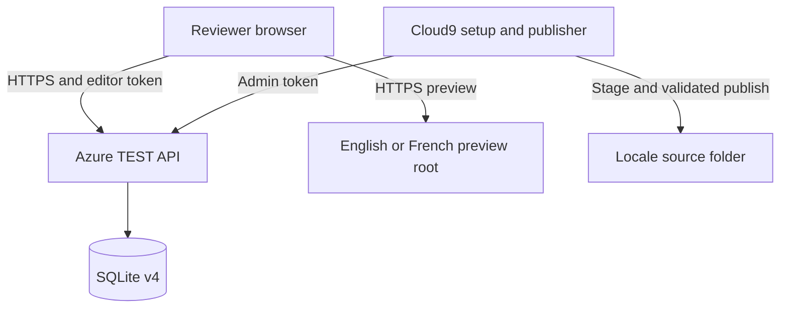

# Architecture

## Boundaries

The Cloud9 checkout is an administrator tool and stays outside the web roots. The locale web roots contain existing source products. Disposable staged previews and the public widget copy live under `/home/ec2-user/environment/wwwroot/_live-edits/v4`, which both hostnames already expose through the shared Apache `/_live-edits` alias. The Azure TEST VM stores collaborative state and never receives filesystem credentials for Cloud9. Publishing is a pull operation initiated on Cloud9.



## Identity

Projects are unique by `site_key` plus `project_path`. `site_key` is `en` or `fr`; a French `/product` cannot resolve to the English project with the same path.

Pages use their source URL path, not their locale namespaced `/_live-edits/v4/products/SITE/` staging URL. An element key is either an explicitly supplied valid key or `le_` plus the first 20 hexadecimal characters of a SHA256 digest over the locale page identity and deterministic DOM element path.

Setup registers the exact key manifest for every page. Saved edit rows contain that manifest hash. The API accepts a save only when the payload contains exactly the registered keys. Publishing joins edits to the current page manifest, so a source structure refresh cannot accidentally publish an older incompatible revision.

## Saved data

An edit is a full versioned snapshot of keyed inner HTML fragments:

```json
{
  "version": 1,
  "elements": {
    "le_0123456789abcdefabcd": "Reviewed <strong>content</strong>."
  }
}
```

The snapshot does not contain a document body, head, script bootstrap, coordinates for edited content, or a filesystem path. The API sanitizes fragments and stores a SHA256 content hash. Revisions increase per project page and require an exact `base_revision`.

Comments are separate records anchored by `element_key` and normalized x and y offsets between zero and one. Presence exists only in Socket.IO memory and is not persisted.

## Publishing algorithm

1. Request the latest unpublished, manifest compatible edit for every project page.
2. Resolve the page URL to a contained source file and compare it with the setup hash.
3. Parse the original source with source locations and deterministically annotate missing keys.
4. Locate every edited key and sanitize each fragment again.
5. Apply inner HTML replacements from the highest source offset to the lowest.
6. Reparse the result and confirm every fragment remained inside its original keyed element.
7. Validate the complete plan before any write.
8. Copy changed originals to a private timestamped backup.
9. Write temporary sibling files and rename them into place. Restore completed files if a later write fails.
10. Mark exact revisions published and store a publish audit event under an idempotent operation ID. A lost response can be reconciled without a second file write or duplicate audit event.

This model preserves the doctype, head, body attributes, scripts, dynamic elements, formatting outside changed blocks, and unrelated assets.
