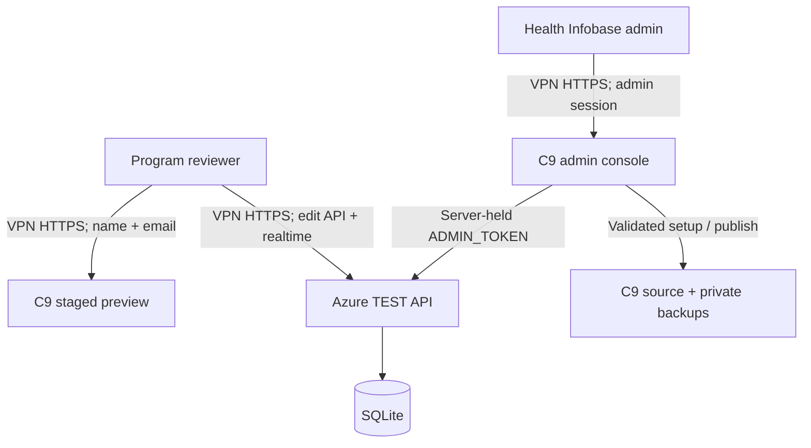

# Architecture

## Runtime boundaries

The admin console runs on C9 because only C9 can safely discover product folders, create staged previews, compare source hashes, write source files, and create backups. Azure stores collaborative state and never receives C9 filesystem credentials. The browser never receives the Azure administrator token.

Apache continues to serve the existing English and French document roots and shared `/_live-edits` alias. A separate configuration adds only `/_live-edits/v4/admin/` as a reverse proxy to `127.0.0.1:3100`. The Azure Node service remains on `127.0.0.1:3000` behind the existing IIS application.

## Project discovery and setup

The C9 service scans top-level folders in both locale web roots, skips known private or generated folders, and lists only folders containing HTML. It compares each locale and URL path with private C9 project state. Adding a project invokes setup with validated argument arrays rather than a shell command string.

Setup copies public files into a hidden build directory, excludes private and executable content, rejects symlinks, annotates safe edit regions, injects explicit deployment data, installs the shared widget, atomically replaces the preview, registers the project and page manifests in Azure, and writes private C9 state.

## Reviewer identity and permissions

In network mode, the widget sends the self-reported name and email on each API request and realtime handshake. Middleware validates both before route handling. The database stores email beside the edit or comment, while public response serializers deliberately remove it.

Reviewer access requires an active project with open review. Administrative routes use a separate Bearer token and can inspect projects regardless of review state. Closing review therefore blocks new reviewer reads and writes without deleting data or preventing an authorized publication.

## Saved data

An edit is a versioned snapshot of registered keyed fragments. Optimistic `base_revision` checks prevent silent overwrite. Comments are separate element-key records. Presence exists only in Socket.IO memory. Project summaries calculate compatible unpublished pages, unresolved comments, activity dates, registered pages, and last publication.

## Publishing algorithm

1. Retrieve the latest unpublished, manifest-compatible edit for each project page.
2. Resolve each page to a contained source file and compare the setup hash.
3. Parse the original source and deterministically annotate missing stable keys.
4. Sanitize and apply each edited fragment to its exact keyed element.
5. Reparse the result and confirm fragments remained inside their original containers.
6. Validate every page before any write.
7. Copy changed originals to a private timestamped backup.
8. Write temporary sibling files and rename them into place; restore completed files after a partial failure.
9. Mark exact revisions published and store an idempotent publish audit event.

The admin UI always executes this algorithm first as a dry run and only enables the confirmed apply operation after the administrator reviews its output.
